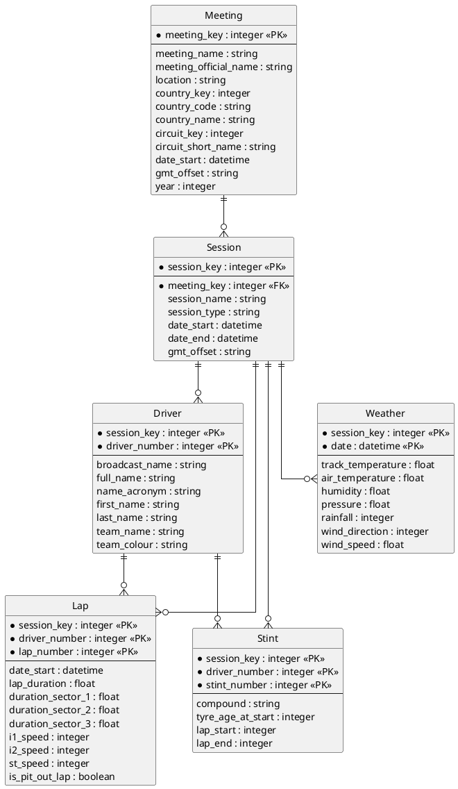

# Source Dataset: OpenF1 API

## Characterization
The OpenF1 API provides real-time and historical data from Formula 1 sessions, including lap times, tyre stints, and track-side weather measurements.

- **Type**: REST API
- **Format**: JSON (converted to CSV for processing)
- **Entities**: Meetings, Sessions, Drivers, Laps, Stints, Weather.

## ER Model (3NF)

## Attribute Summary
- **Unused columns**: `country_key`, `country_code`, `i1_speed`, `i2_speed`, `st_speed`, `pressure`, `wind_direction`.
- **Primary focus**: Performance metrics (lap times, stint length) and track conditions (temperature).
