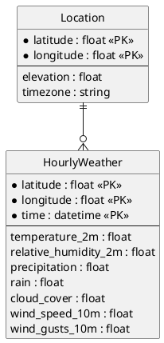

# Source Dataset: Open-Meteo Historical Weather API

## Characterization
The Open-Meteo API provides historical weather data (reanalysis) based on geographic coordinates. It is used to supplement track-side data with broader ambient weather context.

- **Type**: REST API
- **Format**: JSON (converted to hourly CSV for processing)
- **Entities**: Hourly Weather Report.

## ER Model (3NF)

## Attribute Summary
- **Unused columns**: `elevation`, `timezone`.
- **Primary focus**: Ambient humidity, precipitation, and wind conditions to contextualize race performance.
