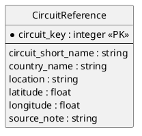

# Source Dataset: Circuit Coordinates (Reference)

## Characterization
A manually maintained CSV file providing the mapping between OpenF1 circuit keys and geographic coordinates required for weather API requests.

- **Type**: Reference File
- **Format**: CSV
- **Entities**: Circuit Reference.

## ER Model (3NF)

## Attribute Summary
- **Unused columns**: `source_note` (metadata only).
- **Primary focus**: Providing the link between the racing dataset (OpenF1) and the environmental dataset (Open-Meteo).
