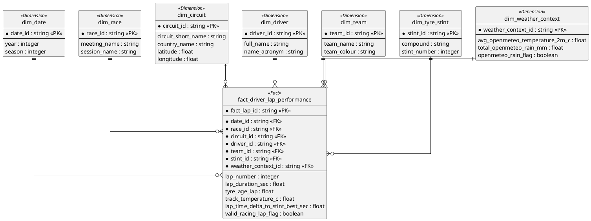

# BI Data: Star Schema Documentation

## 1. Fact Table Grain
The grain of the **fact_driver_lap_performance** table is defined as:
**One entry corresponds to one completed lap by one driver in a specific Formula 1 race session.**

For the **fact_pit_stop** (MVP+), the grain is:
**One entry corresponds to one pit stop event for a driver during a race session.**

---

## 2. Star Schema Visual Model

---

## 3. Design Choices and Justification

### A. Inclusion of `tyre_age_lap` in Fact Table (Targets Q1 & Q5)
- **Choice**: We derive the estimated age of the tyre at the start of every lap during the ETL process.
- **Justification**: This allows for direct correlation between tyre wear and performance loss without requiring window functions in Tableau, ensuring high performance for the "Tyre Age vs Lap Time" line chart.

### B. Denormalizing `track_temperature_c` (Targets Q2)
- **Choice**: Although track temperature is available as a time-series, we aggregate and store it at the lap level in the fact table.
- **Justification**: This supports **Q2** (impact of track temperature on soft tyres) by allowing immediate scatter-plot generation where each point represents a lap's temperature vs its duration.

### C. The `valid_racing_lap_flag` (Targets Q4)
- **Choice**: We implemented a logic to flag "outlier" laps (pit-in/out, first lap, safety cars).
- **Justification**: Essential for **Q4** (driver consistency). Calculating standard deviation or variability on raw lap data would be skewed by pit stops. This choice ensures the BI tool analyzes only "true racing speed."

### D. Weather Context as a Separate Dimension (Targets Q5)
- **Choice**: External weather data (rain, cloud cover) is stored in a separate dimension rather than at the lap level.
- **Justification**: Since ambient weather changes slowly compared to lap times, storing it in a dimension reduces the width of the fact table while still allowing users to filter the entire race by "Rainy" or "Sunny" conditions for **Q5**.
