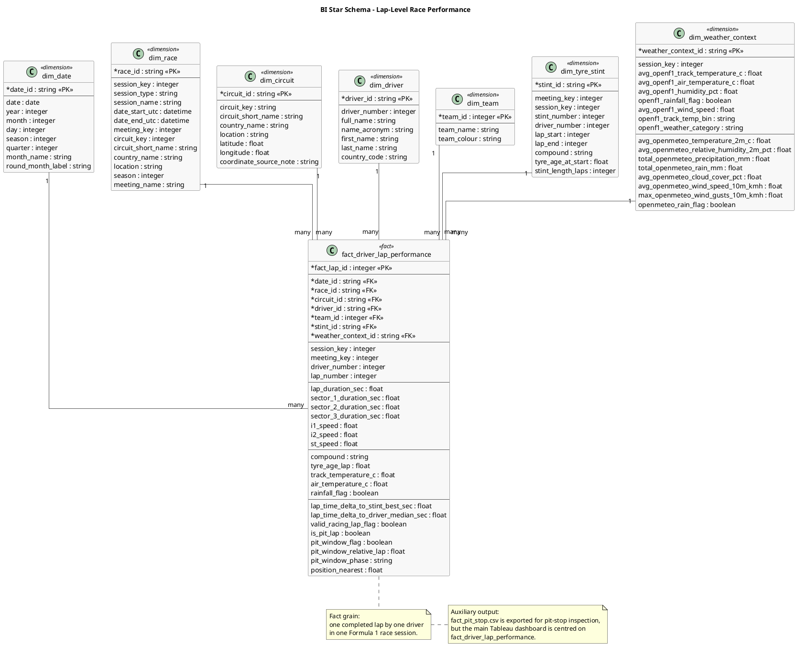

# BI Data: Star Schema Documentation

## 1. Fact Table Grain

The grain of the main **fact_driver_lap_performance** table is defined as:

**One entry corresponds to one completed lap by one driver in a specific Formula 1 race session.**

This grain is used as the central BI fact grain because the main analytical questions require lap-level observations:

- tyre degradation over tyre age
- track-temperature effects on tyre performance
- pit-window pace changes
- driver lap-time consistency
- circuit sensitivity to tyre wear and weather context

The file **fact_pit_stop.csv** is also exported by the pipeline, but it is treated as an auxiliary output rather than the central BI fact table.

For **fact_pit_stop.csv**, the grain is:

**One entry corresponds to one pit-stop event for one driver during one race session.**

Because pit stops have a different grain from completed driver laps, this file is kept separate for inspection and validation. The main Tableau dashboard is centred on **fact_driver_lap_performance.csv**.

---

## 2. Star Schema Visual Model



---

## 3. Design Choices and Justification

### A. Main Fact Grain: One Driver-Lap

- **Choice**: The central fact table is **fact_driver_lap_performance**, with one row per completed lap by one driver in one race session.
- **Justification**: The project questions require lap-level comparison. Tyre degradation, driver consistency, track-temperature effects and pit-window behaviour cannot be represented accurately with only one row per driver-race or one row per race session.

The natural analytical key is:

```text
session_key + driver_number + lap_number
```

The exported table also contains a surrogate key:

```text
fact_lap_id
```

Duplicate driver-lap matches caused by overlapping stint boundaries are resolved during processing so that the final fact table keeps one row per driver-lap.

---

### B. Inclusion of `tyre_age_lap` in the Fact Table

- **Choice**: The pipeline derives `tyre_age_lap` for every driver-lap after matching laps to tyre stints.
- **Justification**: Tyre age is central to tyre degradation analysis. Keeping it directly in the fact table makes Tableau views simpler because the dashboard can group lap-time loss by tyre age without recalculating stint offsets.

Used mainly for:

- Q1: tyre degradation by compound
- Q5: circuit sensitivity to tyre wear

---

### C. Lap-Time Delta Measures

- **Choice**: The fact table stores derived lap-time delta fields:
  - `lap_time_delta_to_stint_best_sec`
  - `lap_time_delta_to_driver_median_sec`
- **Justification**: Raw lap duration is difficult to compare directly across races and circuits because lap lengths differ. Delta-based measures normalize the comparison within a relevant context.

Definitions:

```text
lap_time_delta_to_stint_best_sec
=
lap_duration_sec - best valid lap duration in the same driver-stint
```

This is used for tyre degradation and tyre-age analysis.

```text
lap_time_delta_to_driver_median_sec
=
lap_duration_sec - median valid lap duration for the same driver in the same race session
```

This is used for driver consistency and pit-window pace comparison.

---

### D. Session-Average Track Weather in Fact and Weather Dimension

- **Choice**: OpenF1 weather data is aggregated at race-session level and joined to lap facts through `session_key` / `weather_context_id`.
- **Justification**: This provides a stable weather context for comparing sessions and circuits. The final Q2 and Q5 views use average session track-temperature context, not exact lap-by-lap weather changes.

Important distinction:

- `track_temperature_c` in the fact table is the session-level OpenF1 track-temperature value attached to each lap for dashboard convenience.
- `dim_weather_context` stores the fuller session-level weather context, including OpenF1 weather summaries and Open-Meteo ambient weather summaries.

This means Q2 should be interpreted as:

```text
soft-tyre performance compared across session-average track-temperature contexts
```

not as exact second-by-second or lap-by-lap track-temperature modelling.

---

### E. Weather Context as a Separate Dimension

- **Choice**: Weather context is stored in **dim_weather_context** and linked to the lap fact table using `weather_context_id`.
- **Justification**: Weather is a contextual dimension of a race session. Keeping it in a separate dimension reduces repetition and allows Tableau to use weather categories for filtering, coloring and circuit-level comparison.

The dimension combines:

- OpenF1 track-side weather:
  - average track temperature
  - average air temperature
  - humidity
  - rainfall flag
  - wind speed
  - track-temperature bin
  - weather category
- Open-Meteo ambient weather:
  - 2m temperature
  - relative humidity
  - precipitation and rain
  - cloud cover
  - wind speed and gusts

OpenF1 track temperature is the main weather proxy used in Q2 and Q5 because it is more directly connected to tyre behaviour. Open-Meteo is used as additional ambient weather context.

---

### F. The `valid_racing_lap_flag`

- **Choice**: The pipeline exports `valid_racing_lap_flag` to identify laps suitable for base pace analysis.
- **Justification**: Raw race laps include non-comparable situations such as missing lap times, pit laps and pit-out laps. These laps can distort degradation, temperature and consistency metrics.

The flag is used to separate cleaner racing laps from laps that should not be used directly in pace analysis.

In the final dashboard, additional outlier control is applied through Tableau calculated fields, for example by limiting extreme lap-time deltas for Q1 and Q4.

This means the cleaning logic has two levels:

1. **Pipeline-level flag**: removes clearly non-comparable laps such as missing times, pit laps and pit-out laps.
2. **Dashboard-level calculations**: use median aggregation and additional delta filters to reduce the effect of extreme outliers.

---

### G. Pit-Window Fields in the Main Fact Table

- **Choice**: Pit-window context is represented in the main lap-level fact table using:
  - `is_pit_lap`
  - `pit_window_flag`
  - `pit_window_relative_lap`
  - `pit_window_phase`
- **Justification**: This keeps Q3 aligned with the main star schema and the declared driver-lap grain.

The `pit_window_phase` field labels the lap’s position around a pit stop, for example:

- lap before pit
- pit lap
- pit-out lap
- first normal lap after pit

The final Tableau Q3 metric compares:

```text
median pre-pit pace delta
-
median first-normal-post-pit pace delta
```

Positive values indicate estimated post-pit pace improvement.

This is a pit-window pace metric, not a pure pit-crew performance metric, because it is also affected by fresh tyres, traffic, race strategy and safety-car context.

---

### H. Auxiliary `fact_pit_stop.csv`

- **Choice**: The pipeline exports **fact_pit_stop.csv** separately.
- **Justification**: Pit stops have a different grain from driver-lap facts. A pit stop is an event, while the central dashboard fact is a completed lap.

The auxiliary pit-stop output contains one row per pit-stop event and fields such as:

- `fact_pit_id`
- `race_id`
- `driver_id`
- `team_id`
- `lap_number`
- `pit_time_utc`
- `pit_duration_sec`
- `lane_duration_sec`
- `stop_duration_sec`
- `pit_window_gain_loss_sec`

This file is useful for inspection, validation and possible future analysis. However, it is not used as the central fact table in the main Tableau star schema.

---

### I. Dimension Tables

The main fact table links to seven dimension tables:

| Dimension | Purpose |
|---|---|
| `dim_date` | Calendar and season attributes |
| `dim_race` | Race session and Grand Prix metadata |
| `dim_circuit` | Circuit identity, location and coordinates |
| `dim_driver` | Driver names and identifiers |
| `dim_team` | Team names and team colors |
| `dim_tyre_stint` | Stint-level tyre compound and lap range information |
| `dim_weather_context` | Session-level OpenF1 and Open-Meteo weather context |

This design supports Tableau filtering and grouping by race, circuit, driver, team, compound, tyre stint and weather context while preserving the main fact grain.

---

## Summary

The final BI model is a lap-level star schema centred on:

```text
fact_driver_lap_performance.csv
```

The central fact table contains one completed driver-lap per row and links to date, race, circuit, driver, team, tyre stint and weather context dimensions.

`fact_pit_stop.csv` is retained as an auxiliary output because pit stops have a different event-level grain, but the main Tableau dashboard remains centred on the driver-lap fact table.
